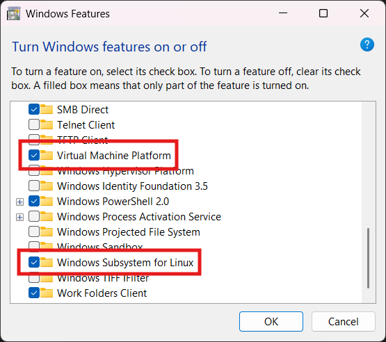
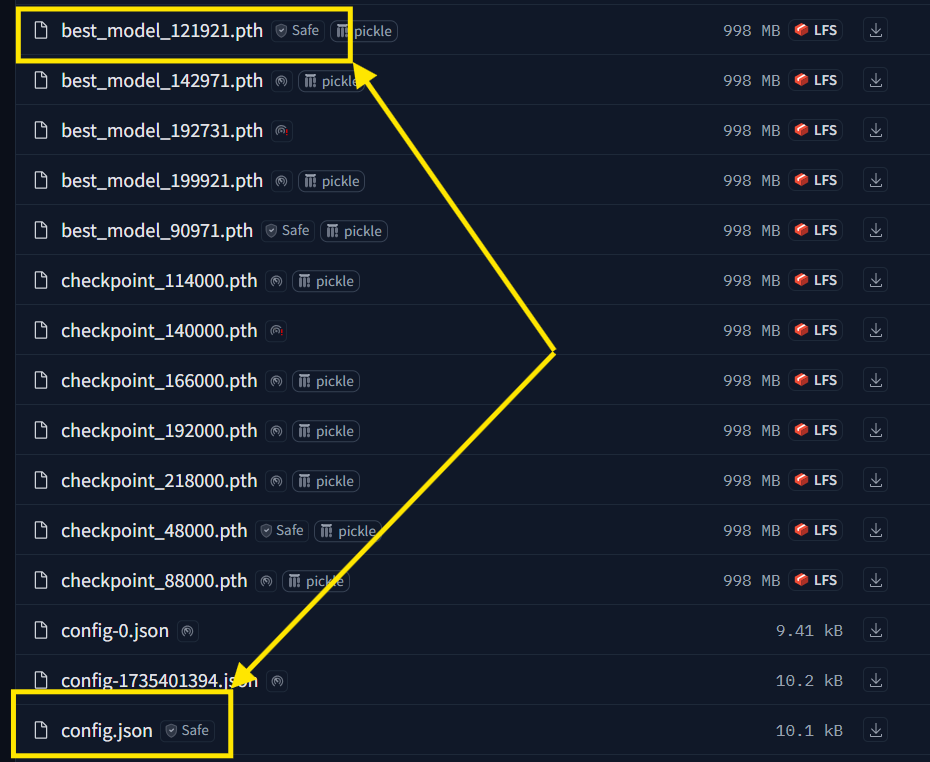
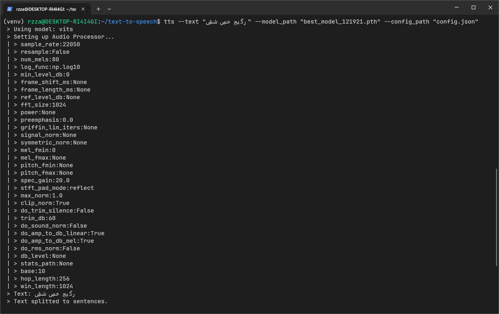

# TTS-Tutorial

### ۱. فعالسازی wsl در ویندوز

ابتدا این گزینه‌ها رو در ویندوز فعال کنید و سیستم رو ری‌استارت کنید



### ۲. نصب دیسترو مورد نظر

با دستور زیر لیست دیسترو‌های در دسترس رو دریافت کنید

```powershell
wsl --list --online
```

سپس با دستور زیر نصبش کنید

```powershell
wsl --install <distroName>
```

با وارد کردن دستور زیر وارد محیط لینوکس بشید

```powershell
wsl
```

### ۳. نصب پایتون در محیط لینوکس

ابتدا پکیج‌ها رو آپدیت کنید

```shell
sudo apt update
```

پکیج‌های زیر رو نصب کنید

```shell
sudo apt install software-properties-common -y
sudo add-apt-repository ppa:deadsnakes/ppa -y
```

نسخه 3.10 پایتون رو نصب کنید

```shell
sudo apt install python3.10 python3.10-venv -y
```

### ۴. نصب پکیج‌ها

یک محیط مجازی ایجاد کنید

```shell
mkdir text-to-speech
cd text-to-speech
python3.10 -m venv venv
```

پکیج TTS رو نصب کنید

```shell
pip install tts
```

سپس eSpeak رو نصب کنید

```shell
sudo apt-get -y install espeak-ng
```

### ۵. دانلود مدل و کانفیگ

از ریپو زیر مدل رو انتخاب و دانلود کنید

[https://github.com/karim23657/Persian-tts-coqui?tab=readme-ov-file#pretrained-models]

این مدل و کانفیگ تست شده
vits male1 (best)



### ۶. اجرای مدل

فایل‌ها رو به پوشه محیط مجازی منتقل کنید و پس از
فعال کردن محیط دستور زیر رو اجرا کنید

```shell
tts --text "شیش سیخ جیگر"  --model_path "model.pth" --config_path "config.json"
```

درصورتی که چنین نتیجه‌ای رو مشاهده کردید یعنی مدل به درستی کار میکند



خروجی نهایی با فرمت wav در پوشه ایجاد میشود

**\*نمونه در ریپو آپلود شده**
